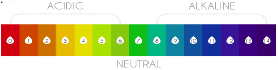

---
[[Version Française](README_fr_CA.md)]
# WQD - Water Quality Drone

A water quality monitoring drone to be deployed on lake surfaces.

## Brainstorming

### Block diagram 

The block diagram was the result of sessions brainstorming about the possibilities and the requisites analysed for Lake Sergent's needs. 

  
   
  <b>Block diagram</b>

Edit this draft into a working diagram in a drawing tool.
### Issues to investigate 

- Sceptic tanks 
- Boats' gas and oil byproducts 
- Mining industry 
- Plastic residues 
- Agricultural residues 
- Algae infestation

## Parameters 

- Temperature 
- pH 
- Turbidity 
- Total dissolved solids 
- Electro Conductivity (EC)
- Dissolved oxygen (DO)
- Oxygen reduction potential (ORP)
- Clorophyl data (algae)

### **Temperature**
Water temperature is one of the five vital variables of water quality testing. Temperature impacts both the compound and organic attributes of surface water. It controls the rate of metabolic and conceptive processes and consequently aquatic life cycle. Dissolved oxygen level in the water, photosynthesis of aquatic plants, metabolic rates of aquatic organisms and affectability of these organisms to pollution, parasites and disease are the major things influenced by water temperature. 

If water temperature increases, decreases or fluctuates, these activities may speed up, slow down or stop. Watertemperature is estimated in Celsius degrees (ºC). Design optimization and implementation of air and water quality monitoring systems are challenges for engineers and researchers for many years.

The LM35 series are precision integrated-circuit temperature sensors, whose output voltage is linearly proportional to the Celsius (Centigrade) temperature, primarily designed for measuring air temperature. Same can be used to measure the temperature of water by following five steps which are used to make it work as a water temperature sensor. 

- Use Cat-5 for the Tether;
- Solder the LM35;
- Copper Cladding;
- Capping the Probe;
- Silicon Sealant to Waterproof.

### **pH**

pH defines the acidic and basic nature of water impurity. A pH value is a number from 1 to 14, with 7 as the middle (neutral) point. Values below 7 indicate acidity which increases as the number decreases, 1 being the most acidic. Values above 7 indicate alkalinity which increases as the number increases, 14 being the most alkaline. 

If the water in a stream is too acidic or basic, the H+ or OHion activity may disrupt aquatic organism’s biochemical reactions by either harming or killing the stream organisms.

  
   
  <b>pH Scale</b>

pH is a decided esteem in light of a characterized scale, like temperature. This implies pH of water isn’t a physical parameter that can be estimated as a fixation or in an amount. Rather, it is a figure in the vicinity of 0 and 14 characterizing how acidic or basic water is along a logarithmic scale. The lower the number, the more acidic the watr is. A pH of 7 is viewed as neutral. On the off chance that the pH of water is too high or low, sea-going creatures living inside it will die. pH can likewise influence the solubility and toxicity of the chemicals and substantial metals in the water.

pH sensor is constructed using pH indicator paper and color recognition sensor TCS230 (Fig. 3). pH indicator paper is immersed in water and respective color change of the paper is captured using color sensor TCS230. Color sensor is interfaced to microcontroller Arduino Uno. RBG value captured by the sensor is processed using the micro controller and mapped to respective pH value.

### **Turbidity**

Turbidity is an optical characteristic of water. It is an expression of the amount of light that is scattered by material in water when a light is shined through the water sample. High groupings of particulate matter influence light infiltration and efficiency, recreational esteems and quality of natural surroundings. Immoderate turbidity or darkness in drinking water is unappealing and may likewise speak to a health concern.

Turbidity sensor is developed using LED and LDR connected to Arduino Uno. The Light dependent resistor or LDR acts as the sensor that indicates the cloudiness of water. The setup for cloudiness sensing is by positioning light emitting diode or LED at 90 degrees to the LDR. Made from high
resistance semiconductor, LDR is a variable resistor whose value decreases with increasing incident of light intensity. 

 The measurement circuit of LDR voltage is used to determine the turbidity of water. When the LED illuminates in clear water, the LDR will send low voltage to the analog input of Arduino Uno. In contrary, when murky water flows, the LDR will send Arduino Uno a high voltage instead.

### **TDS Total dissolved solids**

TDS (Total Dissolved Solids) are dissolved organic and inorganic substances in water. The lesser level is better for the drinking. But an average TDS level of drinking water can be 300 - 500 mg/liter. If reading is more than that I suggest you don’t drink that water.

| TDS Level | Rating |
|------------ | -------- | 
| < 300 | Excellent  | 
| < 300 | Good  | 
| < 300 | Fair  | 
| < 300 | Poor  | 
| > 1200 | Unacceptable  | 

TDS Table Chart 

### **EC Electro-conductivity**
Conductivity characterizes the capacity of water to conduct electricity. This kind of estimation gets to the concentration of ions in a solution. Increasingly the ions higher will be the conductivity. On the off chance that conductivity levels are high, particularly due to dissolved salts,  numerous types of aquatic life are influenced. Skin of animals is dehydrated due to the presence of salts. High concentrations of dissolved solid
can add a laxative effect to water or cause the water to have an unpleasant mineral taste. It is also possible for dissolved ions to affect the pH of water, which in turn may influence the health of aquatic species.

Conductivity sensor is constructed using nichrome and copper wire, both of which act as electrode. Here, copper wire is taken as reference electrode and nichrome wire gives actual conductivity value. A dismantled disposable pen used, behaves as an insulator between the two wires. Both the wires are soldered to an external wire, which is connected to Arduino Uno. Wires are gum taped such that only one centimeter of them is exposed to water sample. Value thus measured gives conductivity of water sample.

## Datasources 
| Data Source | Interval | Typical reading | Typical range | 
|------------ | -------- | --------------- | ------------- | 
| Temperature | Once every 5 minutes | 17,5°C | -25°C to 45°C | 
| pH | Once every 5 minutes | 7,5 | 6 to 9 | 
| Turbidity | Once every 5 minutes | 1500/ppm | ? | 
| Total dissolved solids | Once every 5 minutes | 1500/ppm | ? | 
| Electroconductivity | Once every 5 minutes | 0.5V | ? | 
| Dissolved oxygen | Once every 5 minutes | ? | ? | 
| Oxygen reduction potential | Once every 5 minutes | ? | ? | 
| Chlorophyl Data| Once every 5 minutes | ? | ? | 
| Label| Once every 10 minutes | "Normal" | ["Normal", "Abnormal"] | 

## Technological platforms 
### Ocean Data Buoy Project 

What is it? 

It started as a small/cheap 3D printed buoy that could measure wave height and period data on the ocean, and evolved to who else could benefit from small/cheap wave buoys. What would happen if suddenly this technology could be used to network a bunch of these floating buoys together to get high fidelity wave data for areas of interest? 

We are going to use the buoy as a stationary platform to collect data on site on a long term basis. Placed in a precisely pinpointed location, the buoy will embbed all the instruments available to the project. 

***Power consumption***

The buoy platform will need current to power the microcontroller, the sensor array, and the communication stack, in case of using one. 

This consumption can be supplied by a set of 2 solar cells, rated at 6V 0.5A, to charge a Li-Ion battery rated at 11.1V and 2000mA/h. From the batteries and using power regulators, we can supply the common 6V, 5V and 3.3V to charge all the devices embarked on the buoy platform. 

Refs:

https://opensourceoceanweatherbuoy.wordpress.com/

https://www.thingiverse.com/thing:2070980

### JALC Boat 

What is it? 

JALC Boat is a project aimed to create an aquatic robot educational platform. Its components are 100% free and designed with 3D printing for anyone to create, adapt or modify.

The JALC boat is a USV Platform that will be used in exploratory measurement taking. In conjuction with ROS algorithms it will move along a predetermined route stopping and collecting data at specific mapped waypoints. 

The GPS route can be programmed via GoogleMaps API, or via the device's programming interface. 

Dimensions: 28 x 24 x 28cm (W x L x H)

Weight: +- 3kg 

Max speed: 40 cm/s (+-19 km/h)

Normal temp range: 20 - 25ºC

Estimated operating time: 30 min

Wave height: 7 cm 

Windspeed < 4m/s (1,52 km/h)

It uses 2 thrusters BLDC (Brushless direct current)

Buoyancy force +- 28.6 N 

HC06Bluetooth : max range 20m

Refs: 

https://www.instructables.com/JALC-Boat-Aquatic-Robot-Platform/ 

https://www.thingiverse.com/thing:470370

### ROS 

What is it? 

The Robot Operating System (ROS) is a set of software libraries and tools that help you build robot applications. From drivers to state-of-the-art algorithms, and with powerful developer tools, ROS has what you need for your next robotics project. And it's all open source.

Ref: https://www.ros.org/
