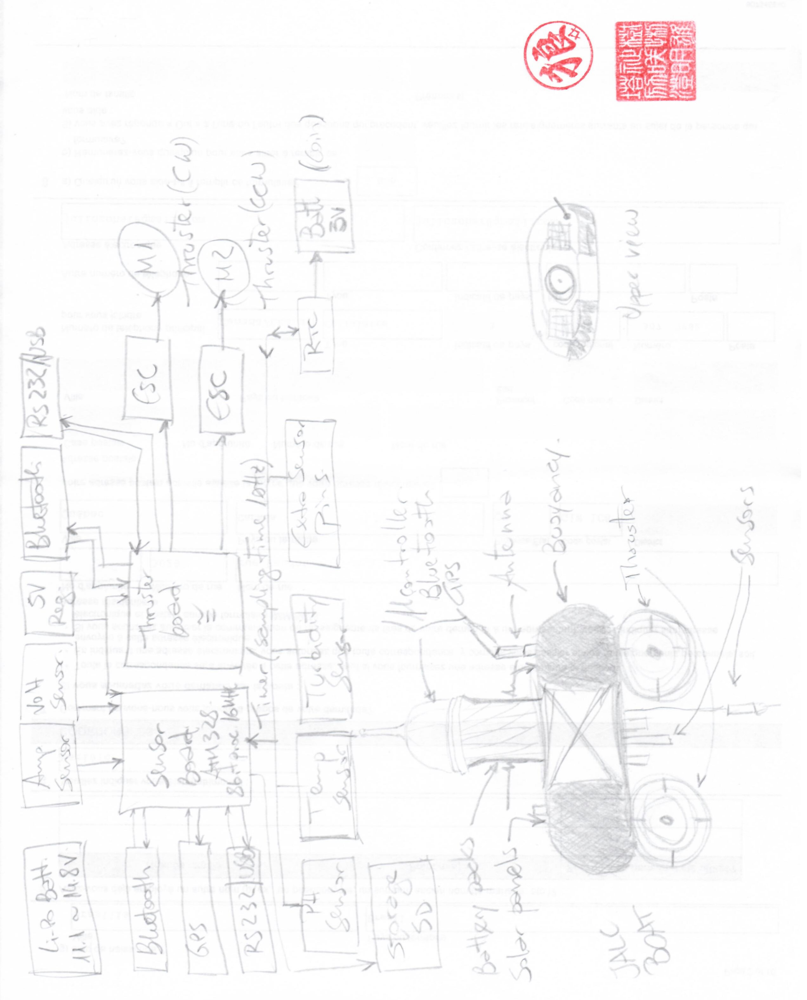

---
[[Version Française](README_fr_CA.md)]
# Water Quality Drone

A water quality monitoring drone to be deployed on lake surfaces.

## Issues to investigate 

- Sceptic tanks 
- Boats' gas and oil byproducts 
- Mining industry 
- Plastic residues 
- Agricultural residues 
- Algae infestation

## Parameters 

- Temperature 
- pH 
- Turbidity 
- Total dissolved solids 
- Electro Conductivity (EC)
- Dissolved oxygen (DO)
- Oxygen reduction potential (ORP)
- Clorophyl data (algae)

## Brainstorming

### Block diagram 

The block diagram was the result of sessions brainstorming about the possibilities and the requisites analysed for Lake Sergent's needs. 

  
   
  <b>Block diagram</b>

Edit this draft into a working diagram in a drawing tool.

## Technological platforms 
### Ocean Data Buoy Project 

What is it? 

It started as a small/cheap 3D printed buoy that could measure wave height and period data on the ocean, and evolved to who else could benefit from small/cheap wave buoys. What would happen if suddenly this technology could be used to network a bunch of these floating buoys together to get high fidelity wave data for areas of interest? 

We are going to use the buoy as a stationary platform to collect data on site on a long term basis. Placed in a precisely pinpointed location, the buoy will embbed all the instruments available to the project. 

Refs:

https://opensourceoceanweatherbuoy.wordpress.com/

https://www.thingiverse.com/thing:2070980

### JALC Boat 

What is it? 

JALC Boat is a project aimed to create an aquatic robot educational platform. Its components are 100% free and designed with 3D printing for anyone to create, adapt or modify.

The JALC boat is a USV Platform that will be used in exploratory measurement taking. In conjuction with ROS algorithms it will move along a predetermined route stopping and collecting data at specific mapped waypoints. 

The GPS route can be programmed via GoogleMaps API, or via the device's programming interface. 

Dimensions: 28 x 24 x 28cm (W x L x H)

Weight: +- 3kg 

Max speed: 40 cm/s (+-19 km/h)

Normal temp range: 20 - 25ºC

Estimated operating time: 30 min

Wave height: 7 cm 

Windspeed < 4m/s (1,52 km/h)

It uses 2 thrusters BLDC (Brushless direct current)

Buoyancy force +- 28.6 N 

HC06Bluetooth : max range 20m

Refs: 

https://www.instructables.com/JALC-Boat-Aquatic-Robot-Platform/ 

https://www.thingiverse.com/thing:470370

### ROS 

What is it? 

The Robot Operating System (ROS) is a set of software libraries and tools that help you build robot applications. From drivers to state-of-the-art algorithms, and with powerful developer tools, ROS has what you need for your next robotics project. And it's all open source.

Ref: https://www.ros.org/
